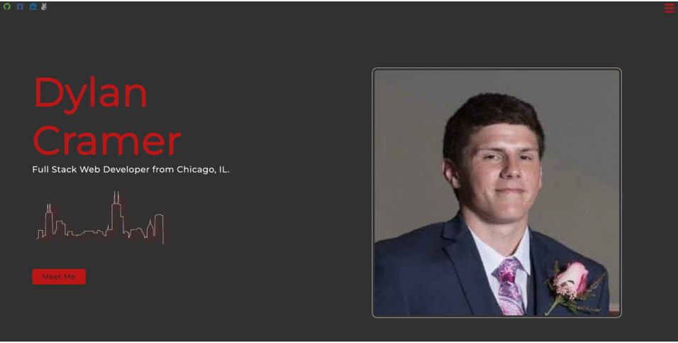
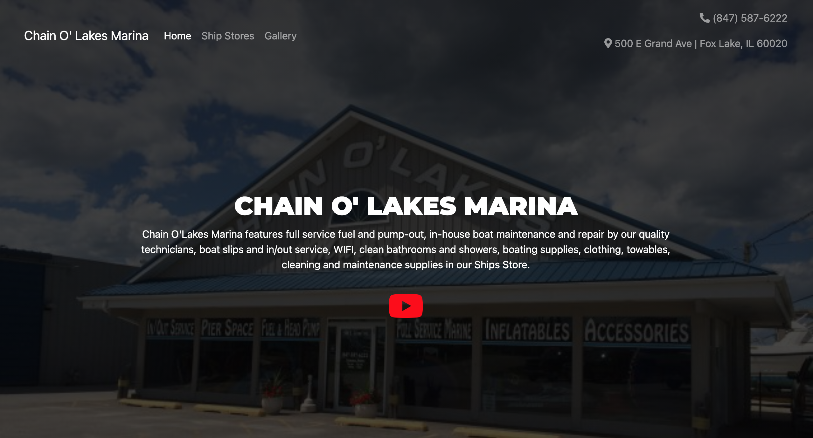

  
  
<!--    -->
<!--     -->
<!--    -->

I am a Front End Web Developer specializinng in JavaScript. I enjoy technology, whether it's working with teams to get products to market, crafting the user stories for each person, or writing code to solve problems. I love creating websites and applications using modern technologies, but I prefer building web applications that can quickly adapt to other frameworks and languages.

See [my website](https://dylancramer.dev for more information!

<h1 align="center">Projects</h1>
<table bordercolor="#66b2b2">
  
  <tr>
    <td width="50%" valign="top">
      <h3 align="center">Portfolio</h3>
         
        
         
        

          
    
  
      

        
<strong>HTML5, CSS3 & JavaScript</strong> - Portfolio Site including links to my projects and ways to get in contact with me

    </td>
    <td width="50%" valign="top">
      <h3 align="center">Stars & Stripes Forever</h3>
         
      
         
        

          
<!--    -->
  
      

        
<strong>GoDaddy, HTML5, CSS3, JavaScript</strong> - eCommerce website for car wrapping business.

    </td>
  </tr>
  
  <tr>
    <td width="50%" valign="top">
      <h3 align="center">Digital Delight</h3>
       
        
       
        

  
  
      

        
<strong>React.js, Framer Motion, & Styled Component</strong> - Website for Digital Delight company

    </td>
    <td width="50%" valign="top">
      <h3 align="center">Chain O' Lakes Marina</h3>
         
        
         
        

          
  
  
      

        
<strong>HTML5, CSS3, Javascript & BootStrap</strong> - Marina website mock up I made for my friends family business.

    </td>
  </tr>
</table>

<h1 align="center">Technologies</h1>

    
    
    
    
    
    
<!--      -->
<!--      -->
    
<!--      -->
<!--      -->
<!--      -->
    
<!--      -->
    
    
<!--      -->
<!--      -->
    
<!--      -->

---

<h1 align="center">Connect</h1>

  
  
<!--   
  
   -->

