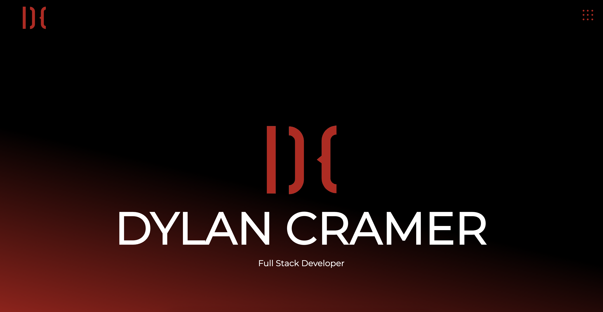

I am a Full Stack Web Developer specializing in JavaScript. Creative, detail-oriented Web Developer who writes readable code. Proven track record of implementing successful full-stack applications. Strong communicator with the ability to work effectively on diverse teams.

Proficient technologies include: JavaScript, React.js, Node.js, Next.js, PHP, Java, Strapi, WordPress, Storybook, Styled Components, HTML, CSS/SASS/SCSS,  RESTful API, Cloudinary, PostgreSQL, MySQL, SQL.

  
  

<h1 align="center">Some Projects</h1>
<table bordercolor="#66b2b2">
  
  <tr>
    <td width="50%" valign="top">
      <h3 align="center">Portfolio</h3>
         
        
         
        

          
    
  
      

        
<strong>Next/React.js, Styled Components, Framer Motion</strong> - Portfolio Site including links to my projects and ways to get in contact

    </td>
    <td width="50%" valign="top">
      <h3 align="center">Timeline That</h3>
         
      
         
        

  
      

        
<strong>Next/React.js, TailwindCSS, Framer Motion, MongoDB, Cloudinary CDN, Stripe, Mandrill</strong> - Creating Timelines for anyone

    </td>
  </tr>
  
  <tr>
    <td width="50%" valign="top">
      <h3 align="center">Digital Delight</h3>
       
        
       
        

  
  
      

        
<strong>React.js, Framer Motion, & Styled Component</strong> - Website for Digital Delight company

    </td>
    <td width="50%" valign="top">
      <h3 align="center">Moulis Financial</h3>
         
        
         
        

          
  
  
      

        
<strong>React.js, Framer Motion, & Styled Component</strong> - Website for Moulis Financial website/p>
    </td>
  </tr>
</table>

