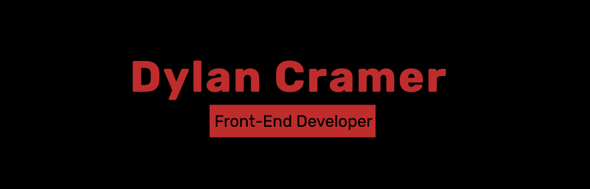

  
  

I am a Full Stack Web Developer specializing in JavaScript. Creative, detail-oriented Web Developer who writes readable code. Proven track record of implementing successful full-stack applications. Strong communicator with the ability to work effectively on diverse teams.

See [my website](https://dylancramer.dev) for more information!

<h1 align="center">Projects</h1>
<table bordercolor="#66b2b2">
  
  <tr>
    <td width="50%" valign="top">
      <h3 align="center">Portfolio</h3>
         
        
         
        

          
    
  
      

        
<strong>Next/React.js, Styled Components, Framer Motion</strong> - Portfolio Site including links to my projects and ways to get in contact

    </td>
    <td width="50%" valign="top">
      <h3 align="center">Chicago Living Group</h3>
         
      
         
        

  
      

        
<strong>Next/React.js, Strapi Headless CMS, Styled Components, Framer Motion, PostgreSQL DB, Cloudinary CDN</strong> - eCommerce website for car wrapping business.

    </td>
  </tr>
  
  <tr>
    <td width="50%" valign="top">
      <h3 align="center">Digital Delight</h3>
       
        
       
        

  
  
      

        
<strong>React.js, Framer Motion, & Styled Component</strong> - Website for Digital Delight company

    </td>
    <td width="50%" valign="top">
      <h3 align="center">Moulis Financial</h3>
         
        
         
        

          
  
  
      

        
<strong>React.js, Framer Motion, & Styled Component</strong> - Website for Moulis Financial website/p>
    </td>
  </tr>
</table>

<h1 align="center">Technologies</h1>

   
  
    
    
    
    
    
    
    
    
    

---

<h1 align="center">Connect</h1>

  
  

